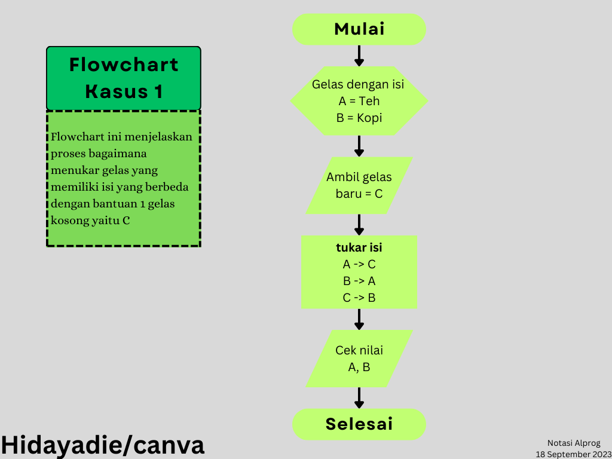
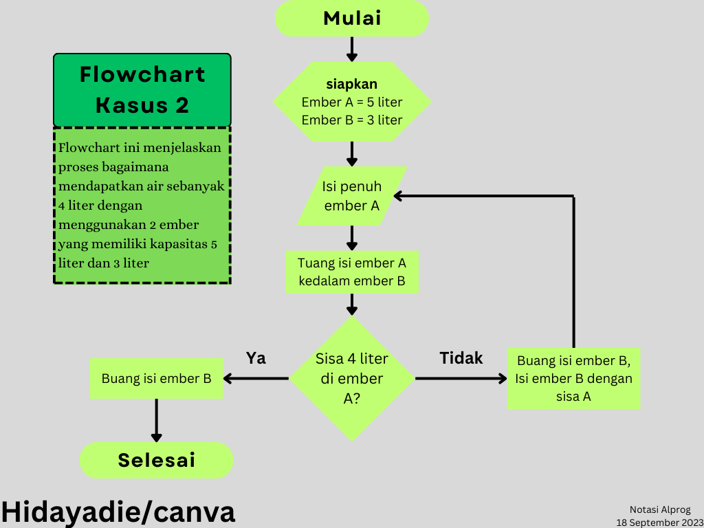

# Tugas Notasi Algoritma & Pemrograman

## Kasus 1 (Menukar isi variabel)
Diketahui terdapat 2 variabel yang masing masing berbeda isinya, anggap saja gelas dengan gelas pertama berisi teh dan gelas kedua berisi kopi. Kita diminta untuk menukar isi dari kedua gelas tersebut menjadi kebalikannya (gelas pertama menjadi berisi kopi, sedangkan gelas kedua berisi teh).

Pemecahan masalah ini bisa kita selesaikan dengan menggunakan algoritma dengan sebagai berikut,
1. Semula kita memiliki 2 gelas tersebut dengan isinya masing masing.
2. Lalu kita mengambil gelas kosong baru sebagai tempat untuk menyimpan sementara.
3. kita menukar isi gelas tersebut dengan cara isi gelas pertama kita tuangkan kedalam gelas baru sehinga gelas A kosong, disaat itu kita dapat menukar isi gelas B kedalam gelas A karena kosong. Hal ini mengakibatkan gelas B menjadi kosong, dan kita bisa mengisinya dengan gelas sementara kita tadi. Sehingga didapatkannya gelas A dan B yang isinya telah ditukar.

Kita dapat mempresentasikan algoritma tersebut kedalam bentuk tabel flowchart sebagai berikut:

Atau juga, kita bisa membuat pseudocode dari kasus tersebut menggunakan bahasa c++
```cpp
// include string,using namespace std,main,dsb
...
//Langkah 1, mendeklarasikan variabel gelas A dan B yang sebagai gelas awal kita
string gelasA = "teh";  //mengisi gelas A dengan nilai teh
string gelasB = "kopi"; //mengisi gelas B dengan nilai kopi

//Langkah 2, kita mengambil gelas baru, yaitu C
string gelasC; //kita membuat variabel baru yaitu gelas C dengan nilai kosong

//Langkah 3, kita menukar isi dari gelas A dan B menggunakan bantuan gelas C
gelasC = gelasA; // nilai dari C adalah nilai A
gelasA = gelasB; // nilai dari A sekarang adalah nilai dari B
gelasB = gelasC; // sekarang nilai dari B adalah nilai dari C yang dimana sebelumnya adalah nilai dari A

/*
Sekarang nilai dari gelas A dan B sudah tertukar,
kita bisa mengeceknya dengan menggunakan cout.
*/
```
Dengan begitu kasus penukaran isi variabel sudah kita selesaikan...

## Kasus 2 (kasus loop sederhana menggunakan ember air)
Sekarang kita memiliki 2 buah ember air, dimana ember pertama berkapasitas maksimal 5 liter sedankan ember kedua berkapasitas maksimal 3 liter. Kita diminta untuk mengambil air sebanyak 4 liter saja, bagaimana caranya?. Disini kita akan menggunakan cara berulang atau melakukan kembali hingga target telah tercapai.

Kita bisa menyelesaikan permasalahan diatas dengan cara seperti berikut:
1. Kita memiliki 2 buah ember, yaitu A yang berkapasitas 5 liter, dan B yang berkapasitas 3 liter
2. Kita mengisisi ember A sampai penuh yaitu 5 liter
3. Menuangkan isi dari ember A kedalam ember B hingga penuh, sehingga kita mendapat ember B berisi sebanyak 3 liter, sedangkan di ember A masih tersisa 2 liter.
4. Kita buang isi dari ember B sehingga membuatnya kosong kembali.
5. Masukkan sisa air pada ember A yaitu 2 liter kedalam ember B, sehingga ember B berisi 2 liter.
6. Kita ulangi pengisian pada ember A, yaitu isi ember A sebanyak 5 liter hingga penuh.
7. Lalu kita memasukkan isi ember A ke dalam ember B lagi, tetapi karena ember B sudah berisi 2 liter maka kita hanya mengurangi volume atau isi dari ember A sebanyak 1 liter.
8. Karena 5 dikurangi 1 adalah 4 maka kita sudah berhasil mendapatkan air sebanyak 4 liter
9. Jangan lupa membuang isi dari ember B karena kita hanya akan memerlukan sebanyak 4 liter

Berikut tabel flowchart yang bisa menggambarkan penyelesaian tersebut:
 